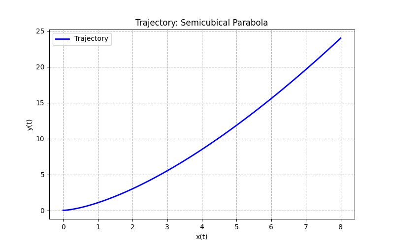

Here are the complete solutions to your kinematics problem set, formatted in Markdown. You can copy this text directly into any Markdown viewer or editor. 

***

# Mechanics I: Kinematics - Problem Set 2 Solutions

## Problem 1 – Uniform and uniformly accelerated motion

1. **Velocity and Acceleration:**
   The velocity is the first derivative of position with respect to time, and acceleration is the second derivative.
   $$
   v(t) = \frac{dx}{dt} = v_0 + at
   $$
   $$
   a(t) = \frac{dv}{dt} = a
   $$

2. **Calculations for given parameters ($x_0=0$, $v_0=5$ m/s, $a=-2$ m/s²):**
   * **Stopping time:** The body stops when $v(t) = 0$.
     $$
     5 - 2t = 0 \implies t = 2.5\text{ s}
     $$
   * **Maximum velocity:** Since the acceleration is negative, the velocity is strictly decreasing for $t \ge 0$. The maximum velocity occurs at the start ($t=0$).
     $$
     v_{max} = 5\text{ m/s}
     $$
   * **Maximum displacement:** Because the object stops and reverses direction at $t=2.5$ s, the maximum positive displacement occurs exactly at the stopping time.
     $$
     x(2.5) = 0 + 5(2.5) + \frac{1}{2}(-2)(2.5)^2 = 12.5 - 6.25 = 6.25\text{ m}
     $$

3. **Visualization (Python/Matplotlib snippet):**
   ```python
   import numpy as np
   import matplotlib.pyplot as plt

   t = np.linspace(0, 5, 100)
   x = 5*t - t**2
   v = 5 - 2*t
   a = -np.full_like(t, 2)

   plt.plot(t, x, label='Position x(t)')
   plt.plot(t, v, label='Velocity v(t)')
   plt.plot(t, a, label='Acceleration a(t)')
   plt.legend()
   plt.xlabel('Time (s)')
   plt.show()
   ```

---

## Problem 2 – Projectile motion

* **Equations of motion:**
  Integrating the constant gravitational acceleration $\vec{a} = (0, -g)$ yields:
  $$
  x(t) = v_0 \cos(\alpha) t
  $$
  $$
  y(t) = v_0 \sin(\alpha) t - \frac{1}{2}gt^2
  $$

* **Time of flight ($T$):** Set $y(T) = 0$ (ignoring $t=0$).
  $$
  v_0 \sin(\alpha) T - \frac{1}{2}gT^2 = 0 \implies T = \frac{2v_0 \sin(\alpha)}{g}
  $$

* **Maximum height ($H$):**
  Occurs at $t = T/2 = \frac{v_0 \sin(\alpha)}{g}$. Substitute this into $y(t)$:
  $$
  H = v_0 \sin(\alpha) \left( \frac{v_0 \sin(\alpha)}{g} \right) - \frac{1}{2}g \left( \frac{v_0 \sin(\alpha)}{g} \right)^2 = \frac{v_0^2 \sin^2(\alpha)}{2g}
  $$

* **Range ($R$):**
  Substitute $T$ into $x(t)$:
  $$
  R = x(T) = v_0 \cos(\alpha) \frac{2v_0 \sin(\alpha)}{g} = \frac{v_0^2 \sin(2\alpha)}{g}
  $$

* **Maximum range:**
  $R$ is maximized when $\sin(2\alpha) = 1$, which occurs at $2\alpha = 90^\circ$, so $\alpha = 45^\circ$.

---

## Problem 3 – Elimination of time and interpretation of acceleration

* **Eliminate parameter $t$:**
  From $x(t) = 2t^2$, assuming $t \ge 0$, we get $t = \sqrt{x/2}$. Substituting into $y(t)$:
  $$
  y(x) = 3 \left(\sqrt{\frac{x}{2}}\right)^3 = \frac{3}{2\sqrt{2}} x^{3/2}
  $$
  *(The trajectory is a semi-cubical parabola).*

* **Visualization (Python/Matplotlib snippet):**
  ```python
  import numpy as np
  import matplotlib.pyplot as plt

  t = np.linspace(0, 2, 500)
  x = 2 * t**2
  y = 3 * t**3

  plt.figure(figsize=(8, 5))
  plt.plot(x, y, 'b-', lw=2, label='Trajectory')
  plt.title('Trajectory: Semicubical Parabola')
  plt.xlabel('x(t)')
  plt.ylabel('y(t)')
  plt.grid(True, linestyle='--')
  plt.legend()
  plt.show()
  ```
  

* **Velocity and Acceleration:**
  $$
  \vec{v}(t) = \left( \frac{dx}{dt}, \frac{dy}{dt} \right) = (4t, 9t^2)
  $$
  $$
  |\vec{v}(t)| = \sqrt{16t^2 + 81t^4} = t\sqrt{16 + 81t^2}
  $$
  $$
  \vec{a}(t) = \left( \frac{d^2x}{dt^2}, \frac{d^2y}{dt^2} \right) = (4, 18t)
  $$
  $$
  |\vec{a}(t)| = \sqrt{16 + 324t^2}
  $$

* **Is the acceleration constant?**
  No. While the $x$-component is constant, the $y$-component increases linearly with time.

---

## Problem 4 – Circular motion

* **Vectors:**
  $$
  \vec{r}(t) = (R\cos(\omega t), R\sin(\omega t))
  $$
  $$
  \vec{v}(t) = \frac{d\vec{r}}{dt} = (-R\omega\sin(\omega t), R\omega\cos(\omega t))
  $$
  $$
  \vec{a}(t) = \frac{d\vec{v}}{dt} = (-R\omega^2\cos(\omega t), -R\omega^2\sin(\omega t))
  $$

* **Magnitudes:**
  $$
  |\vec{r}(t)| = \sqrt{R^2\cos^2(\omega t) + R^2\sin^2(\omega t)} = R
  $$
  $$
  |\vec{v}(t)| = \sqrt{(-R\omega\sin(\omega t))^2 + (R\omega\cos(\omega t))^2} = R\omega
  $$
  $$
  |\vec{a}(t)| = \sqrt{(-R\omega^2\cos(\omega t))^2 + (-R\omega^2\sin(\omega t))^2} = R\omega^2
  $$

* **Centripetal property:**
  Notice that $\vec{a}(t) = -\omega^2 (R\cos(\omega t), R\sin(\omega t)) = -\omega^2 \vec{r}(t)$. The negative sign indicates the acceleration points in the exact opposite direction of the position vector (i.e., towards the origin/center of the circle).

---

## Problem 5 – Elliptical motion (purely kinematic)

* **Velocity and Acceleration:**
  $$
  \vec{v}(t) = (-a\omega\sin(\omega t), b\omega\cos(\omega t))
  $$
  $$
  \vec{a}(t) = (-a\omega^2\cos(\omega t), -b\omega^2\sin(\omega t)) = -\omega^2\vec{r}(t)
  $$

* **Is the magnitude of velocity constant?**
  $$
  |\vec{v}(t)| = \omega\sqrt{a^2\sin^2(\omega t) + b^2\cos^2(\omega t)}
  $$
  No, it is not constant unless $a = b$ (which would be circular motion).

* **Where is the velocity maximum?**
  Velocity is maximized where the term inside the square root is largest. 
  * If $a > b$, the maximum is when $\sin^2(\omega t) = 1$ (at the semi-minor axis, $y = \pm b$), yielding $v_{max} = a\omega$.
  * If $b > a$, the maximum is when $\cos^2(\omega t) = 1$ (at the semi-minor axis, $x = \pm a$), yielding $v_{max} = b\omega$.

---

## Problem 6 – Cycloid: trajectory of a point on a rolling circle

1. **Velocity and Acceleration vectors:**
   $$
   \vec{v}(t) = (R\omega - R\omega\cos(\omega t), R\omega\sin(\omega t)) = R\omega (1-\cos(\omega t), \sin(\omega t))
   $$
   $$
   \vec{a}(t) = (R\omega^2\sin(\omega t), R\omega^2\cos(\omega t))
   $$

2. **Magnitude of velocity and stopping points:**
   $$
   |\vec{v}(t)| = R\omega\sqrt{(1-\cos(\omega t))^2 + \sin^2(\omega t)} = R\omega\sqrt{1 - 2\cos(\omega t) + \cos^2(\omega t) + \sin^2(\omega t)}
   $$
   $$
   |\vec{v}(t)| = R\omega\sqrt{2 - 2\cos(\omega t)}
   $$
   The point temporarily "stops" when $|\vec{v}(t)| = 0$, which means $\cos(\omega t) = 1$. This occurs at $t = \frac{2k\pi}{\omega}$ (where $k$ is an integer).

3. **Maximum values:**
   * Max $|\vec{v}|$ occurs when $\cos(\omega t) = -1$, yielding $|\vec{v}|_{max} = R\omega\sqrt{4} = 2R\omega$ (at the top of the arc).
   * Magnitude of acceleration: $|\vec{a}(t)| = \sqrt{R^2\omega^4(\sin^2(\omega t) + \cos^2(\omega t))} = R\omega^2$. (The acceleration magnitude is strictly constant).

5. **Reference Frame Comparison:**
   In a reference frame translating with the center of the rolling circle (velocity $v = R\omega$ along the $x$-axis), the point merely undergoes uniform circular motion. The ground frame velocity is the vector sum of the translation and the circular motion.

---

## Problem 7 – 2D motion with a given acceleration

* **Velocity:**
  Integrating acceleration $\vec{a} = (2, -3)$ with initial condition $\vec{v}(0) = (1,0)$:
  $$
  \vec{v}(t) = \int \vec{a} dt = (2t + C_x, -3t + C_y) \implies \vec{v}(t) = (2t + 1, -3t)
  $$

* **Position:**
  Integrating velocity with initial condition $\vec{r}(0) = (0,0)$:
  $$
  \vec{r}(t) = \int \vec{v}(t) dt = (t^2 + t, -1.5t^2)
  $$

---

## Problem 8 – Relative motion

1. **Relative velocity $\vec{v}_{A/B}$:**
   $$
   \vec{v}_{A/B} = \vec{v}_A - \vec{v}_B = (3, 1) - (1, -2) = (2, 3)
   $$

2. **Direction of relative motion:**
   The angle $\theta$ relative to the positive $x$-axis is:
   $$
   \theta = \arctan\left(\frac{v_{y, A/B}}{v_{x, A/B}}\right) = \arctan\left(\frac{3}{2}\right) \approx 56.3^\circ
   $$

---

## Problem 9 – Change of reference frame (Copernican → geocentric)

2. **Position of Mars relative to Earth:**
   $$
   \vec{r}_{M/Z}(t) = \vec{r}_M(t) - \vec{r}_Z(t)
   $$
   * Components:
     $$
     x_{M/Z}(t) = R_M\cos(\omega_M t) - R_Z\cos(\omega_Z t)
     $$
     $$
     y_{M/Z}(t) = R_M\sin(\omega_M t) - R_Z\sin(\omega_Z t)
     $$
   *(This parametric equation traces out an epitrochoid, resulting in the famous apparent "retrograde" loops of Mars as seen from Earth).*

---

## Problem 10 – Analysis of motion from numerical data

1. **Approximate velocity (Central Difference Method):**
   $$
   v(t) \approx \frac{x(t+\Delta t) - x(t-\Delta t)}{2\Delta t}
   $$
   Analytically, $x(t) = t + 0.05t^2 \implies v(t) = 1 + 0.1t$. 
   If we substitute the mathematical $x(t)$ into the central difference formula, we get exactly $1 + 0.1t$.

2. **Approximate acceleration:**
   $$
   a(t) \approx \frac{x(t+\Delta t) - 2x(t) + x(t-\Delta t)}{(\Delta t)^2}
   $$
   Analytically, $a(t) = 0.1$. Plugging the quadratic into the difference formula gives exactly $0.1$.

3. **Comparison:**
   For a polynomial of degree 2 (constant acceleration), the central difference method yields the *exact* analytical solution.

4. **Effect of time step:**
   If using the central difference method for a purely quadratic function, the time step $\Delta t$ has no effect on the truncation error (the error is exactly 0). However, if one uses the forward difference method $v(t) \approx \frac{x(t+\Delta t) - x(t)}{\Delta t}$, the error is proportional to $\Delta t$ (specifically, an error of $0.05\Delta t$), so a smaller time step improves accuracy linearly.

***

git add .
git commit -m "Push sol"
git push